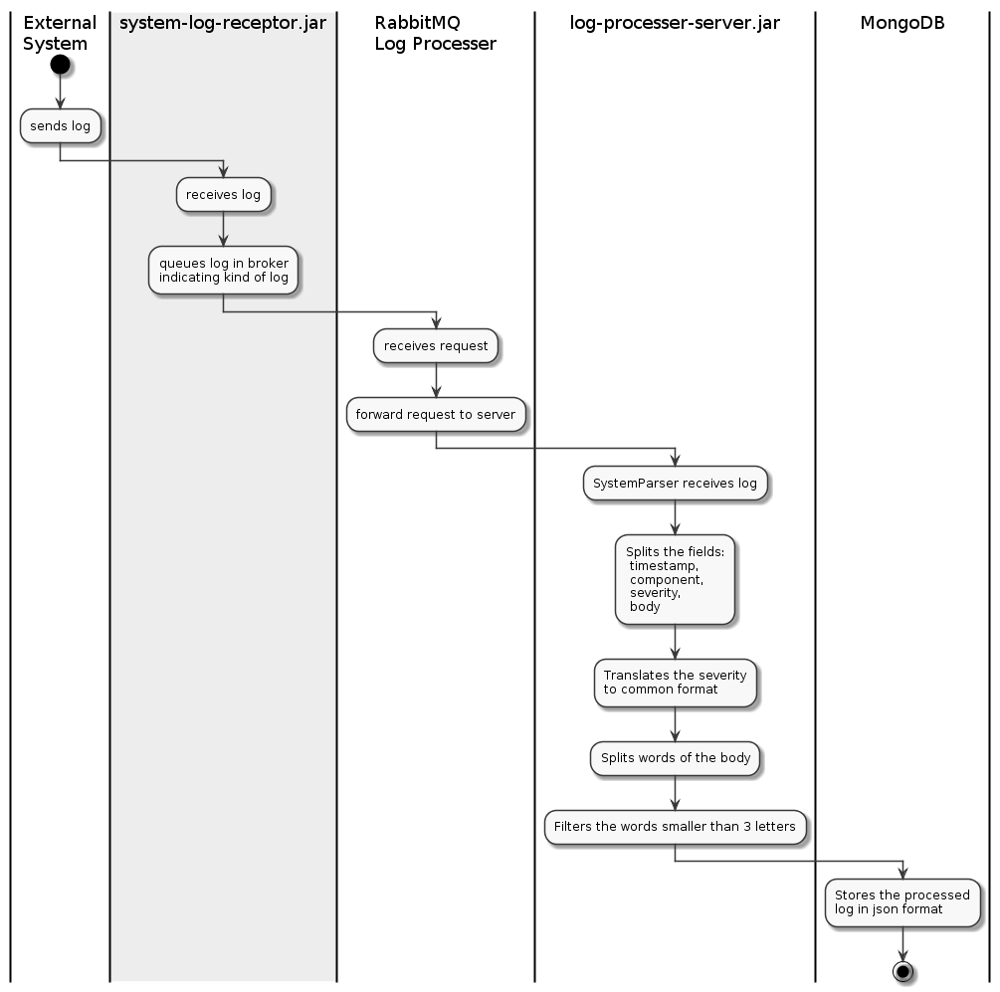
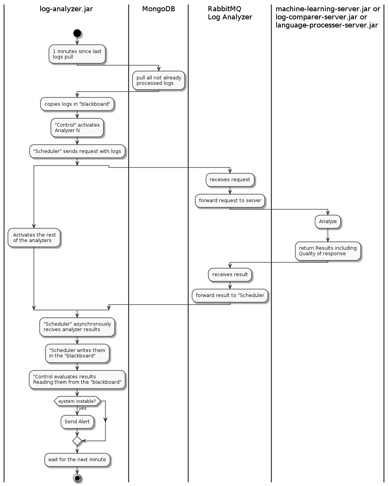

============
 Práctica 2
============

Log Analyzer System
===================

:Autor: Antonio Camas Maestre
:git: https://github.com/antoniocamas/log-analyzer-architecture.git
   
.. contents:: Contenidos
	      
.. raw:: pdf

   PageBreak
	      
Decisión y Justificación de los Patrones Arquitectónicos
----------------------------------------------------------

El sistema está divido en dos subsistemas independientes. La comunicación entre ambos será a través de una base de datos en la que un subsistema volcará los logs procesados y el otro los recuperará para su análisis.

Subsistema *Log Processer*
^^^^^^^^^^^^^^^^^^^^^^^^^^

El patrón *Broker* ordena la estructura general del *Log Processer*. Sin embargo el servidor que procesa los logs presenta varios módulos con requisitos específicos que nos llevan a combinar el patrón *Broker* gobernante con el Patrón *Layers*. 

Patrón *Broker*
"""""""""""""""

El subsistema usa el patrón *Broker* que está justificado por las siguientes **fuerzas**:

- El sistema debe ser **elástico** pues debe atender a un numero indefinido de sistemas y aplicaciones generando logs.
- El sistema requiere elasticidad una **arquitectura distribuida** responde bien a esta necesidad. 
- El sistema ha de poder crecer, debemos proveer de mecanismos que abstraigan a los clientes de la localización de los servidores.

El sistema no es ni tan grande ni tan complicado como para empujarnos a un patrón de microservicios. Por tanto el patrón *Broker* es el adecuado para responder a las necesidades.

Como **consecuencia** por el uso  del patrón Broker el *Log Processer* presenta:

- Transparencia de localización de los *logs Receptors* (clientes) y de los filtros de logs (servidores).
- Extensibilidad en clientes y servidores.
- Posibilidad de cambiar las implementaciones de sus componentes.
- Portabilidad
- Reusabilidad

Sin embargo esta decisión presenta algunas **responsabilidades**:

- Menos eficiente que el monolito.
- Es complicado de probar extremo a extremo.
- Es complicado de depurar de extremo a extremo.
- Aunque en general el patrón Broker complica la gestión de errores. La poca relevancia de perder un dato de entrada hace que en este sistema en particular sea sencillo controlar los errores pues ignorar la linea de log que provoca el fallo es viable.

Patrón *Layers*
"""""""""""""""

A su vez la parte de ofrece servicios de procesado de logs está organizada siguiendo un patrón *Layers*. Las **fuerzas** que empujan a usar este patrón son:

- Existe la necesidad de tener flexibilidad en el procesamiento de los logs: eliminar, cambiar o añadir etapas. 
- Agrupación de los componentes con responsabilidades similares (parsers y procesadores del testo por ejemplo).
- Descomposición de un componente complejo.

Las **consecuencias** de usar un patrón *Layers*:

- Podría existir una reutilización de capas
- Dependencias locales: un cambio afecta como mucho a las capas adyacentes
- Las interfaces bien definidas dan la posibilidad de cambiar las implementaciones de los componentes.

Subsistema *Log Analyzer*
^^^^^^^^^^^^^^^^^^^^^^^^^

El subsistema *Log Analyzer* está gobernado por una arquitectura siguiendo el patrón *Blackboard*.  Sin embargo la organización de los analizadores de logs combina el anterior patrón con el patrón *Broker* por razones de dimensionamiento, flexibilidad, mantenimiento, etc.

Patrón *Blackboard*
"""""""""""""""""""

Las **fuerzas** que empujan a usar el patrón *Blackboard* son:

- Es necesario usar diferentes algoritmos para el análisis de los logs.
- Es necesario poder añadir, modificar o eliminar herramientas de análisis.
- Hay algoritmos que resuelven parcialmente el problema.
- Hay resultados aproximados involucrados en el análisis.

Las **consecuencias** pues de este patrón *Blackboard* son:

- el subsistema permite usar diferentes analizadores.
- el subsistema se adaptará bien a los cambios en los analizadores.
- el esfuerzo en mantenimiento está acotado.
- los analizadores son reutilizables.
- es tolerante a fallos. Si un analizador falla se ignorará ignorará el resultado de su análisis.
- es robusto.

Las **responsabilidades**: 

- Dificultad para probar el subsistema completo de extremo a extremo.
- No se pueden garantizar soluciones de calidad.
- Dificultad para diseñar una buena estrategia de control.
- Poca eficiencia.
- Dificultad en la paralelización. Algo que se intentará paliar combinándolo con el patrón *Broker* como se verá más adelante.
- Alto coste de desarrollo.

Patrón *Broker*
"""""""""""""""
  
Los analizadores del subsistema se disponen siguiendo un patrón *Broker* debido a las siguientes **fuerzas**:

- El sistema debe ser **elástico** pues debe atender a un numero indefinido de sistemas y aplicaciones generando logs.
- Flexibilidad en el análisis de los logs: poder cambiar el servicio de análisis en ejecución.
- Capacidad de añadir, modificar o eliminar herramientas de análisis, sin tener que hacer crecer la aplicación original indefinidamente. Bastará con agregar, modificar o eliminar servidores.
- Intentar mejorar el rendimiento introduciendo paralelismo.
- Las ventajas de los sistemas distribuidos vistos anteriormente cuando describiamos el subsistema *Log processer* aplican de igual forma aquí.

Las **consecuencias** y **responsabilidades** son las mismas que al aplicar el mismo patrón *Broker* en el subsistema *Log Processer*.

Estructura de la solución 
--------------------------

El sistema se estructura en dos subsistemas: *Log Processer* y *Log Analyzer*.

La fase de procesado de logs expone una interfaz para cada tipo de fuente de logs, convierte los logs de distintas fuentes a un formato unificado, eliminando datos superfluos. Guarda los logs procesados (en base de datos) para su posterior análisis; La fase de análisis obtiene, cada minuto, de la capa de persistencia bloques de logs y los analiza, lanzando una alarma si de su análisis se prevé un mal funcionamiento en el sistema monitorizado.

A continuación se describirán ambos subsistemas relacionándolos con los elementos de los patrones arquitectónicos presentes en el diseño.

*Log Processer*
^^^^^^^^^^^^^^^

Diagramas:
 - Ver el `Diagrama de Componentes - Log Processer`_.
 - Ver el `Diagrama de Artefactos - Log Processer`_.

Presenta una arquitectura gobernada por el patrón *Broker*, y está compuesto por los siguientes elementos:

- Componente *Application Log Receptor*: representa los elementos *Cliente* y *Proxy de Cliente* de patrón *Broker*. Expone una interfaz para recibir por HTTP los logs de las aplicaciones del sistema monitorizado. Consume la interfaz del componente *Log Processer Broker* encolando los logs recibidos al servicio de procesado de logs.

- Componente *System Log Receptor*: análogamente representa los elementos *Cliente* y *Proxy de Cliente* de patrón *Broker*. Exponiendo una interfaz para recibir por HTTP los logs de los elementos sistema.

- Componente *Log Processer Broker*: representa el elemento *Broker* del patrón. Expone las interfaces para los clientes y el registro de los servidores. Como particularidad de esta solución, los clientes no esperan la respuesta de los servidores, por lo tanto este *broker* no necesita implementar la interfaz del camino de vuelta de los mensajes.

- Servicio *Log Processer*: representa la parte *Servidor* y *Proxy de Servidor* del patrón Broker. Consume la interfaz de registro de servidores del *broker*. El servicio está formado por varios componentes organizados por un patrón *Layers* que aporta flexibilidad al servicio de procesado de logs.

- Componente *App Log Parser*: parte del servicio *Log Processer*, representa parte de la capa *Parser* del patrón *Layers*. Se encarga de la recepción y separación de los campos timestamp, componente, severidad, texto del log. 

- Componente *System Log Parser*: Es análogo al anterior, es parte del servicio *Log Processer*, representa parte de la capa *Parser* del patrón *Layers*. Se encarga de la recepción y separación de los campos timestamp, componente, severidad, texto del log y mapear la severidad de un entero a las cadenas 1->ERROR, 2->WARN, 3->INFO, 4->DEBUG.

- Componente *Log Body Processer*: parte del servicio *Log Processer*, representa parte de la capa *Body Processer*. Es llamado por los componente de la capa *Parser* y se encarga de separar el texto del log en las diferentes palabras que lo componen. Al terminar llama al componente *Noisy Words Filter*.

- Componente *Noisy Words Filter*: parte del servicio *Log Processer*, representa parte de la capa *Body Processer*. Se encarga de eliminar todas las palabras de 3 o menos caracteres al objeto de facilitar la indexación. Consume la interfaz de la siguiente capa *Persistant Adapter Layer*.

- Componente *Log Recorder*: parte del servicio *Log Processer*, representa parte de la capa *Persistant Adapter Layer*. Hace persistir los logs en el formato unificado en una base de datos.

- Estructura de datos: El formato unificado será un documento *json* con la siguiente estructura:

.. code:: json

	  {
	   'timestamp': timestamp,
	   'componente': comp,
	   'severity': sever,
	   'body': [text]
	  }

Vista lógica  del subsistema *Log Processer*.
"""""""""""""""""""""""""""""""""""""""""""""   
	  
.. figure:: vistas/Dia-Componentest-Log-Processer_v1.png
   :scale: 100%
   :name: Diagrama de Componentes - Log Processer
	 
   Diagrama de Componentes

Vista de despliegue del subsistema *Log Processer*. 
"""""""""""""""""""""""""""""""""""""""""""""""""""

.. figure:: vistas/Dia-Artefactos-Log-Processer_v1.png
   :scale: 100%
   :name: Diagrama de Artefactos - Log Processer
	 
   Diagrama de Artefactos
	  
	  
*Log Analyzer*
^^^^^^^^^^^^^^

Diagramas:

- Ver el `Diagrama de Componentes - Log Analyzer`_.
- Ver el `Diagrama de Artefactos - Log Analyzer`_.

Presenta una estructura dirigida por el patrón arquitectónico *Blackboard* combinado con el patrón *Broker* para dotar a los analizadores de las ventajas de los sistemas distribuidos. Está compuesto por los siguientes elementos:

- Componente *Control*: representa el elemento *Control* de patrón *Blackboard*. Se comunica con la pizarra y el representante de los analizadores que ya veremos más adelante. Tiene las responsabilidad de tomar la decisión sobre cuándo hay que comenzar a analizar nuevos logs, elegir los analizadores que entrarán en juego e interpretar las respuestas de los analizadores para tomar la decisión de si el sistema está entrando en mal funcionamiento o no. 

- Componente *Blackboard*: representa el elemento *Blackboard* de patrón *Blackboard*. Se trata de un componente que ofrece un espacio de comunicación común entre el resto de elementos de subsistema.

- Componente *Analyzer Tool Scheduler*: Es una adaptación del elemento *Algorithm* de patrón *Blackboard*. Aúna la comunicación que los Analizadores que son los verdaderos representantes de los elementos *Algorithm* del patrón, haciendo las veces de Proxy. Los analizadores se organizan con un patrón *Broker* del que el *Analyzer Tool Scheduler* hace también las veces de los elementos *Cliente* y *Proxy de Cliente* del sistema distribuido *Broker*. Se encarga por tanto de recibir las indicaciones de componente *Control*, encolar las peticiones a los analizadores a través del *Analysis Tool Broker* y recibir los resultados de los análisis de forma asíncrona propiciando el paralelismo, y de escribir estos resultados convenientemente en el componente *Blackboard*.

- Componente *Analysis Tool Broker*: representa el elemento *Broker* del patrón. Expone las interfaces para los clientes y el registro de los servidores. Trabajará de forma asíncrona por lo que ofrece interfaces de doble sentido a servidores y clientes. 

- Componentes *Log Comparer Server*, *Language Processer Server* y  *Machine Learning Server*: representan los elementos *Servidor* y *Proxy de Servidor* del patrón *Broker*. Consumen la interfaz de registro de servidores del *broker*. Reciben paquetes de logs para analizar y devuelven resultados a través del *Analysis Tool Broker*. La especificación interna de los analizadores está fuera del objetivo de esta descripción arquitectónica. Todos los analizadores pueden trabajar en paralelo y en diferentes máquinas. Mejorando el rendimiento y aportando elasticidad.

Vista lógica  del subsistema *Log Analyzer*.
""""""""""""""""""""""""""""""""""""""""""""  
  
.. figure:: vistas/Dia-Componentest-Log-Analyzer_v1.png
   :scale: 100%
   :name: Diagrama de Componentes - Log Analyzer
	 
   Diagrama de Componentes

Vista de despliegue del subsistema *Log Analyzer*. 
"""""""""""""""""""""""""""""""""""""""""""""""""""

.. figure:: vistas/Dia-Artefactos-Log-Analyzer_v1.png
   :scale: 100%
   :name: Diagrama de Artefactos - Log Analyzer
	 
   Diagrama de Artefactos
   
	  
Comportamiento Dinámico de la solución 
---------------------------------------

*Log Processer*
^^^^^^^^^^^^^^^

Ver el `Diagrama de Secuencia - Log Processer - system logs`_ y `Diagrama de Secuencia - Log Processer - Application logs`_.

Vista de procesos del subsistema *Log Processer*. Sistemas
""""""""""""""""""""""""""""""""""""""""""""""""""""""""""

	 
   Diagrama de Secuencia para logs de sistema

Vista de procesos del subsistema *Log Processer*. Aplicaciones
""""""""""""""""""""""""""""""""""""""""""""""""""""""""""""""
   
.. figure:: vistas/Dia-Secuencia-Log-Processer_App_v1.png
   :scale: 100%
   :name: Diagrama de Secuencia - Log Processer - Application logs
	 
   Diagrama de Secuencia para logs de aplicación

*Log Analyzer*
^^^^^^^^^^^^^^

Vista de procesos del subsistema *Log Analyzer*.
""""""""""""""""""""""""""""""""""""""""""""""""

	 
   Diagrama de Secuencia.
